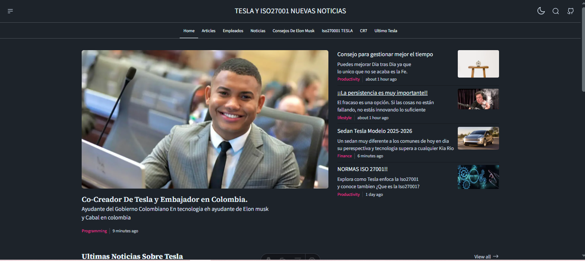

# Pagina Tesla-Iso27001


> **ℹ️ Info**  
> Un sitio Didactico Orientado para mostrar un ejemplo de uso de Astro y sobre Tesla y La Iso27001




## 🚀 Installation

Follow the steps below to set up and run the project locally:

### Clone the Repository

```bash
git clone https://github.com/verlon2020/Tesla-Iso27001
```

### Install Dependencies

``` bash
bun install
```

### Run Development Server

```bash
bun dev
```

### Running Keystatic CMS

1. Rename `.env.example` to `.env`.

2. Set `RUN_KEYSTATIC=true`.

3. Start the development server:

 ```bash
    bun dev 
  ```

4. Open `http://localhost:4321/keystatic` in your browser.

## ✨ Features

### Implemented Features

- Content Layer
- Keystatic CMS
- Navigation
- Responsive Design
- Pagination
- Search Functionality
- RSS Feed
- Sitemap
- Dark Mode
- SEO Optimization (~)

### Upcoming Features

- Open Graph (OG) Image Generation

## 💻 Technologies

This project leverages cutting-edge web technologies:

- [Astro V5.7](https://astro.build) - Modern static site builder
- [KeyStatic](https://keystatic.com) - Headless content-management system
- [Tailwind CSS](https://tailwindcss.com) - Utility-first CSS framework
- [DaisyUI](https://daisyui.com/) - Tailwind CSS component library
- [TypeScript](https://typescriptlang.org) - Typed JavaScript
- [MDX](https://mdxjs.com) - Markdown with JSX support
- [Bun V1.2.10](https://bun.sh) - Fast JavaScript runtime
- [Vercel](https://vercel.com) - Deployment platform
- [HugeIcons](https://hugeicons.com) - Icon library

